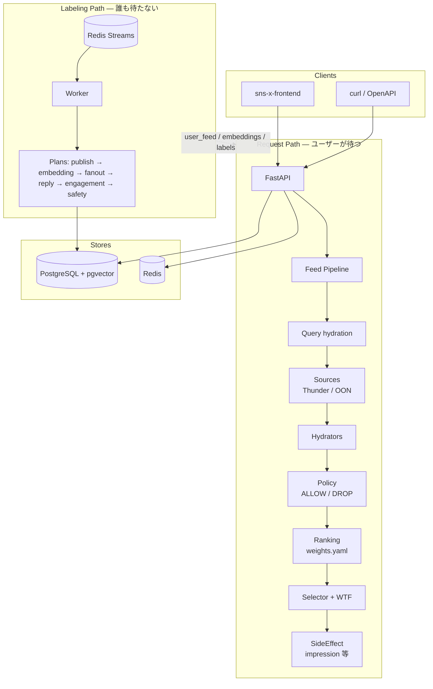
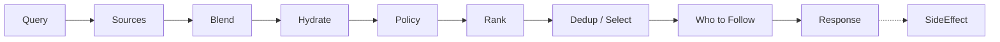
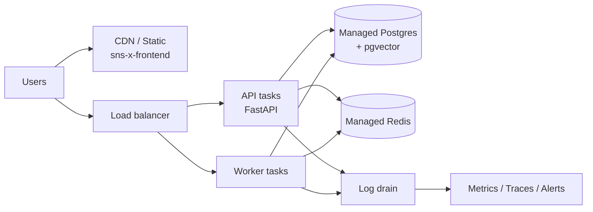

# sns-x-api

個人開発向け SNS の **API / フィード基盤** です。X（旧 Twitter）が公開している [x-algorithm](https://github.com/xai-org/x-algorithm)（For You feed）の **設計思想** を借りつつ、Rust の大規模サービス群ではなく **FastAPI + PostgreSQL + Redis** に簡略化した実装です。

Web UI は別リポジトリ **sns-x-frontend** です。

| | |
|---|---|
| スタック | FastAPI / PostgreSQL（pgvector）/ Redis Streams / Alembic |
| 既定ポート（Compose） | API `8001` · Postgres `5433` · Redis `6380` |
| バージョン | `2.1.0`（`GET /health`） |
| ライセンス | [MIT](LICENSE) © 2026 maeplego |

> **本番向けではありません。** 学習・個人プロダクトの土台として公開しています。認証・認可・運用・モデレーションは最小構成です。公開インターネットに出す前に、後述の注意点と拡張示唆を読んでください。

---

## このリポジトリがやっていること

x-algorithm の中核は「候補を集め、見せてよいか決め、並べ、返す」です。本リポジトリはその流れを **小さく再現** しています。

| x-algorithm の考え方 | 本リポジトリでの置き換え |
|---|---|
| Home Mixer（候補パイプライン） | `FeedPipeline`（Query → Source → Hydrate → Policy → Rank → Select） |
| Thunder（圏内の最近投稿） | Postgres の `user_feed`（fan-out で埋める） |
| Phoenix / SimClusters（圏外候補・学習モデル） | pgvector 類似検索 + 線形スコア（`ranking/weights.yaml`） |
| Visibility Filtering | `app/policy/` + safety ラベル（`spam_suspect` / `nsfw` / `do_not_amplify`） |
| 重い後処理（ラベル付け等） | Labeling Path（Redis Streams + Worker + Plan） |
| 観測・透明性 | `request_id` 付きログ、`GET /under-the-hood` |

コードをコピーしているわけではなく、**段の切り方と責務分離** を移植しています。

---

## システム全体の概略



### Request Path（ホーム TL）



- **For You**（`GET /feed`）: Thunder + OON → Policy → 線形ランキング → 作者多様性
- **Following**（`GET /feed/following`）: Thunder のみ・新しい順（ランキングなし）
- **スレッド**（`GET /posts/{id}/thread`）: 会話単位・古い順

### Labeling Path（投稿のあと）

Worker が `post.created` などを受け、ORDER の小さい Plan から実行します。

```
publish → embedding → fanout → reply_side_effects → engagement_init → safety
```

Request Path は Labeling が書いた表（`user_feed` / embeddings / labels）を読むだけです。**TL 表示と投稿後処理を同じリクエストに混ぜません。**

### 3 層分離（触る場所の地図）

| 層 | 責務 | 触る場所 |
|---|---|---|
| **Policy** | 見せる / 見せない（スコアは触らない） | `app/policy/` |
| **Ranking** | 順序だけ | `app/ranking/`, `ranking/weights.yaml` |
| **Labeling / Safety** | 裏方の重い処理・ラベル | `app/labeling/`, `app/safety/` |

---

## x-algorithm との対応（実装したもの / していないもの）

参考: [xai-org/x-algorithm](https://github.com/xai-org/x-algorithm)

### 簡略化して実装しているもの

| 本家の概念 | 本リポジトリ |
|---|---|
| Candidate pipeline の段 | `FeedPipeline` の各ステージ |
| In-network（Thunder 相当） | fan-out + `user_feed` 読み出し |
| Out-of-network retrieval | ハッシュベース embedding + pgvector 近傍 |
| フィルタ / VF の一部 | ブロック・ミュート・非公開・停止・Age・興味なし・OON 増幅抑制など |
| スコア合成 | YAML の重み付き線形和 + OON discount / low-cred / 作者多様性 |
| 会話の畳み込み | For You 上の conversation dedupe |
| Who to Follow 差し込み | フィード 1 ページ目へのモジュール挿入 |
| アカウント健全性の萌芽 | `cred_score` + safety ラベル |
| 制限の説明 | `GET /under-the-hood` |

### 意図的に実装していないもの（本家・本番規模）

- Phoenix / SimClusters の **学習・サービング**（Grok 系ランカー、二塔 retrieval の本実装）
- Thunder の **インメモリ巨大クラスタ** / Kafka 前提の配信
- Visibility Filtering の **INTERSTITIAL**（警告の後ろに出す）。本 API は主に ALLOW / DROP
- 広告・課金・実験フラグ（A/B）基盤
- 画像・動画・メディア NSFW モデレーションの本実装（キーワード NSFW の簡易版のみ）
- **DM**、Lists、Trends、検索ランキングの本家相当
- モデレーション用 **RBAC**（管理者 / スタッフ / モデレーター権限）— 全ユーザー同一ロール
- 本番級の認可・監査・レート制限・鍵管理

足すときは新しい巨大サービスを増やすより、**既存の段（Rule / 重み / Plan / Source）に 1 個足す** 方針が扱いやすいです。

---

## articles（設計解説）

[`articles/`](articles/) には、アーキテクチャを **層ごと・機能ごと** に読み進めるための Markdown があります。実装の「なぜこの切り方か」を追う用です。実行コードの正は常に `app/` 側です。

| 文書 | 内容の目安 |
|---|---|
| [01-architecture](articles/01-architecture.md) | Request / Labeling、Compose、原則 |
| [02-api-db-auth](articles/02-api-db-auth.md) | ユーザー・投稿・JWT |
| [03-feed-pipeline](articles/03-feed-pipeline.md) | フィードパイプライン骨格 |
| [04-policy](articles/04-policy.md) | Policy 層 |
| [05-ranking](articles/05-ranking.md) | Ranking 層 |
| [06-labeling](articles/06-labeling.md) | Labeling Path / Worker |
| [07-plugin-registry](articles/07-plugin-registry.md) | Plan の登録 |
| [08-side-effects](articles/08-side-effects.md) | SideEffect・通知・impression |
| [09-fanout-feed](articles/09-fanout-feed.md) | fan-out / Thunder 相当 |
| [10-out-of-network](articles/10-out-of-network.md) | OON / pgvector |
| [11-mutes-filters-diversity](articles/11-mutes-filters-diversity.md) | ミュート・Age・作者多様性 |
| [12-replies-threads](articles/12-replies-threads.md) | 返信 / スレッド |
| [13-not-interested](articles/13-not-interested.md) | 興味なし / 非表示 |
| [14-following-timeline](articles/14-following-timeline.md) | Following 面 |
| [15-who-to-follow](articles/15-who-to-follow.md) | Who to Follow |
| [16-series-map](articles/16-series-map.md) | 全体地図（段と機能の索引） |

記事の一部は連載形式の文体が残っています。**現行プロダクト差分**（safety ラベル、cred、Under the Hood、OON 増幅抑制など）は記事より `app/safety/`・`app/policy/rules.py`・`ranking/weights.yaml`・`GET /under-the-hood` を優先してください。

---

## クイックスタート

```bash
cd sns-x-api
cp .env.example .env
docker compose up --build
```

```bash
curl http://localhost:8001/health
# {"status":"ok","version":"2.1.0"}
```

- OpenAPI: http://localhost:8001/docs
- CORS 既定: `http://localhost:5174`（`CORS_ORIGINS` で変更）

### テスト

```bash
pip install -e ".[dev]"
pytest
```

### Docker なし（API のみ）

Postgres / Redis は Compose で先に上げるか、ホストの接続先を `.env` で合わせてください。

```bash
python -m venv .venv
source .venv/bin/activate  # Windows: .venv\Scripts\activate
pip install -e ".[dev]"
alembic upgrade head
uvicorn app.main:app --reload --port 8001
```

---

## 主な機能（API 面）

- 登録 / ログイン（JWT）
- For You / Following、Who to Follow
- 投稿・いいね・返信・引用・リポスト
- 検索、フォロー一覧、プロフィール更新
- ブロック / ミュート / 興味なし
- 通知（既読など）
- Safety ラベルと `cred_score`
- `GET /under-the-hood`（自分に効いている制限の見える化）

---

## ディレクトリ構成

```
sns-x-api/
├── app/
│   ├── main.py
│   ├── core/             # config, DB models, safety_models
│   ├── request/          # HTTP API / auth / routers
│   ├── labeling/         # Worker, flows, registry
│   ├── policy/           # Visibility rules
│   ├── ranking/          # Scorer
│   ├── safety/           # labels, NSFW keywords, cred_score
│   └── embedding/        # 類似投稿検索
├── ranking/weights.yaml
├── articles/             # 設計解説（上記）
├── alembic/
├── tests/
├── docker-compose.yml
└── LICENSE
```

---

## 利用上の注意

1. **秘密情報** — `.env` の `JWT_SECRET` を本番相当で使い回さない。リポジトリにコミットしない。
2. **デフォルト認証は薄い** — HS256 JWT・長期有効・リフレッシュなし・権限ロールなし。誰でも同じ API 能力です。
3. **Safety はヒューリスティック** — キーワード NSFW・簡易 spam / cred であり、商用モデレーションの代替になりません。
4. **埋め込みは学習モデルではない** — ハッシュ系ベクトルです。推薦品質の上限を理解したうえで使ってください。
5. **法務・事業・届出** — 公開運用前に次節「役所への届出・法務上の注意」を読む。本 README は法律助言ではありません。
6. **データ永続** — Compose の volume は開発用。バックアップ方針は自分で設計してください。
7. **CORS / ポート** — フロントのオリジンと `CORS_ORIGINS` を一致させる。
8. **スケール前提ではない** — 単一 Postgres / Redis / Worker 想定。水平スケールやマルチリージョンは未設計です。

---

## 役所への届出・法務上の注意

このリポジトリで SNS を **一般向けに公開・運営** する場合、技術以外に行政手続・法令の確認が必要になることがあります。以下は日本で個人・小規模事業者が公開 SNS を始めるときに頻出する論点の **整理メモ** です。**最終判断は所轄の総合通信局・弁護士等に確認してください。** 制度は改正されるため、公式資料の最新版を当たってください。

### 電気通信事業法（総務省）— いちばん引っかかりやすい点

公開タイムライン型の SNS / 掲示板は、多くの場合「利用者同士が投稿を見る **場** を提供する」ものであり、回線設備を自ら置かず **他人の通信を媒介しない** なら、登録・届出が不要ないわゆる **第3号事業**（事業法上の整理）に寄ることがあります。

一方、次があると **登録または届出が必要** になりやすいです。

| 機能・状況 | よくある整理（目安） |
|---|---|
| 公開 TL・プロフィール・いいね・リポストだけ | 「場」の提供にとどまり、第3号で手続不要になりやすい |
| **DM / 1対1・限定グループのメッセージ**、通話、利用者間のファイル転送 | **他人の通信の媒介** とされ、届出（規模により登録）が必要になりやすい |
| 登録制 SNS で前年度の月間アクティブ利用者数の平均が **1,000万以上** | 媒介がなくても届出対象になりうる（大規模指定の整理） |
| 鍵アカウント（フォロワー限定の投稿表示） | 一般には「投稿の公開範囲」であり、**DM の代替にはならない**。ただし DM を別途足せば届出論点は別問題 |

**本リポジトリの現状:** DM・チャット・利用者間ファイル転送は実装していません。公開 TL 中心の indie 公開なら、電通事法上は第3号寄りの設計を維持しやすいです。**DM を足す前に**、届出の要否を所轄へ確認するのが安全です。

#### どこに相談・提出するか

- 本社（個人なら主たる事業所）を管轄する **総合通信局**（総務省の地方支分部局）に事前相談・届出
- 総務省の解説資料例:
  - [電気通信事業参入マニュアル（追補版）等](https://www.soumu.go.jp/main_sosiki/joho_tsusin/top/tel_service/)（最新 PDF を確認）
  - 検索サービス・SNS・掲示板と届出の関係をまとめたガイドブック類

届出が必要と判明したら、事業開始前（または開始と同時）に手続を済ませる想定でスケジュールを組んでください。無届営業は罰則の対象になり得ます。

#### 第3号でもゼロ規律ではない

手続不要でも「電気通信事業を営む者」として、**検閲の禁止**や**通信の秘密**など、電通事法上の最低限の規律が問題になり得ます。また令和4年改正以降、クッキー等の **外部送信に関する表示義務**（いわゆる外部送信規律）が、一定の SNS / 掲示板等にも及びうる整理があります。計測タグ・広告 SDK をフロントに載せる前に対象可否を確認してください。

### あわせて検討しがちなもの（届出以外）

| 領域 | 内容の目安 |
|---|---|
| **個人情報保護法** | プライバシーポリシー、利用目的の通知・公表、安全管理、委託先管理。海外クラウド利用時は越境移転の整理 |
| **利用規約・コミュニティガイドライン** | 禁止行為、削除・停止の基準、免責。運用とコード（Policy / モデレーション）を一致させる |
| **プロバイダ責任制限法** | 削除請求・発信者情報開示への対応フロー（窓口・期限・記録） |
| **青少年・表現規制** | 年齢確認や有害情報への対応方針（簡易 NSFW キーワードだけでは足りないことが多い） |
| **著作権・肖像** | ユーザー投稿のライセンス条項、侵害通報窓口 |
| **特定商取引法・景表法など** | 有料課金・広告・ステマ表現を扱う場合 |
| **法人・税務** | 法人設立の要否、消費税・申告。個人の趣味公開と「事業」の境界はケース次第 |
| **ドメイン・商標** | サービス名・ロゴの衝突確認 |

### 本リポジトリを使う人への実務的なすすめ

1. **最初の公開範囲を決める** — 「公開 TL のみ / DM なし」なら電通事法の届出リスクを抑えやすい。
2. **DM やチャットをロードマップに入れるなら** — 実装より先に総合通信局または専門家へ要否確認。
3. **利用規約・プライバシーポリシー・問い合わせ窓口** を公開と同時に用意する。
4. **削除・通報・停止** の運用手順を書いてからモデレーション機能を足す（RBAC・監査ログとセット）。
5. 迷ったら **自己判断で「たぶん第3号」と決め打ちしない**。公式資料と所轄相談を優先する。

---

## これから機能を足すときの示唆

原則: **新しい巨大サービスを増やす前に、既存のフックに 1 個足す。**

| やりたいこと | 足す場所の例 |
|---|---|
| 「見せたくない」条件 | `app/policy/rules.py` に Rule |
| 「並べ替えの好み」 | `ranking/weights.yaml` と scorer |
| 投稿後の重い処理 | `app/labeling/flows/<name>/` に Plan |
| 候補の取り方 | Source（Thunder / OON の隣） |
| 透明性 | Under the Hood の項目を増やす |

### セキュリティ（認証・認可）

現状は「ログイン済みか」程度です。拡張の方向性:

- **認証の強化** — 短い access token + refresh、回転、端末セッション無効化、パスワードハッシュ方針の見直し、任意で WebAuthn / OIDC
- **認可** — リソース単位（自分の投稿だけ削除可、など）を依存関数 / ポリシーオブジェクトに集約。いま散らばりやすいので早期に一本化
- **入力・乱用対策** — レート制限、投稿サイズ上限、添付ウイルススキャン、ボット対策（CAPTCHA / Turnstile）
- **秘密管理** — 環境変数ではなく Secret Manager / KMS。`JWT_SECRET` のローテーション手順

### RBAC（ロールベースアクセス制御）の導入案

いま **ロールはありません**。運用組織を置くなら、例えば次のような階層を DB の `role`（または別テーブルの grant）で持ち、モデレーション API だけをガードします。

| ロール例 | 想定できる権限 |
|---|---|
| 一般ユーザー | 自分の投稿・設定・通常の TL |
| アルバイト / ジュニアモデレーター | 通報キュー閲覧、限定ラベル付与、一時非表示提案 |
| モデレーター | 投稿削除 / 非表示、アカウント一時停止、ラベル確定 |
| スタッフ | 上記 + ユーザーサポート用の閲覧、監査ログ参照 |
| 管理者 | ロール付与、グローバル設定、強制ログアウト |
| 特権（break-glass） | 緊急時のみ。通常は無効化し、利用は必ず監査 |

実装のヒント:

- FastAPI の `Depends(require_roles("moderator", "admin"))`
- **権限はロール名のハードコード散在を避け**、`permission` 集合（`post.hide`, `user.suspend`, `label.write`）に落とす
- モデレーション操作は **誰が・何を・なぜ** を監査テーブルへ（後述）
- フロントはロールで管理画面ルートを出し分け（あくまで UX。認可の正は API）

### ログ取得

- いま: structlog 系の構造化ログ + `request_id`
- 拡張: JSON ログを stdout → Fluent Bit / Vector → OpenSearch / CloudWatch / Datadog
- 相関: `request_id` / `user_id` / `post_id` / `plan_name` を必須フィールドに
- アクセスログとアプリログを分け、PII（メール等）はマスク

### 監査（Audit）

モデレーション・権限変更・一括削除は「あったら困る操作」です。

- `audit_events` テーブル（actor, action, target, before/after, reason, ip, request_id, created_at）
- 改ざん耐性が必要なら追記専用ストアや WORM ストレージ
- Under the Hood とは別物（ユーザー向け説明 ≠ 運営監査）

### クラウド構成案（例）

小規模 indie の一例です。必須ではありません。



| 層 | 候補 |
|---|---|
| フロント静的配信 | Cloudflare Pages / S3+CloudFront / Netlify |
| API / Worker | Fly.io / Render / Cloud Run / ECS Fargate |
| DB | RDS / Cloud SQL / Neon（pgvector 対応を確認） |
| Redis | ElastiCache / Upstash / Memorystore |
| 秘密情報 | AWS Secrets Manager / GCP Secret Manager / Doppler |
| 観測 | OpenTelemetry → Grafana Cloud / Datadog / CloudWatch |

API と Worker は **同じイメージ・別コマンド** のまま分けてスケールするのが楽です。

### デプロイ方法の模索

1. **今すぐ** — `docker compose` を VPS に載せる（開発・検証）
2. **次** — GitHub Actions で test → image build → staging へ
3. **その次** — マイグレーションをデプロイパイプラインの明示ステップに（`alembic upgrade head`）
4. **本番** — ゼロダウンタイム（ローリング）、ヘルスチェック、ロールバック手順、DB バックアップの定期リストア試験

チェックリスト例: 秘匿値の差し替え、CORS を本番オリジンのみ、`APP_ENV=production`、DEBUG 無効、HTTPS 強制、管理 API のネットワーク制限。

---

## 設計原則（短く）

1. **Request Path / Labeling Path を分離**
2. **Policy ≠ Ranking**
3. **起動時 fail-fast / 実行時 degrade**
4. **段に足す**（巨大サービス増殖を避ける）
5. **制限は説明可能に**（Under the Hood）

---

## ライセンス

[MIT](LICENSE) © 2026 maeplego

x-algorithm 自体のライセンス・商標とは無関係です。設計の学習用参照であり、X / xAI の公式製品ではありません。
