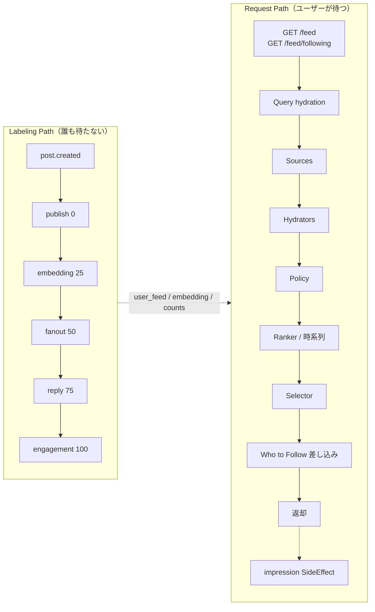
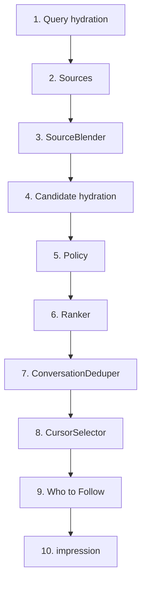

# 個人開発 SNS を x-algorithm 流に設計する【まとめ: 第1〜15回の地図】

連載は **第15回（`v1.5`）で終わり**です。この記事に新しい実装はありません。どのパイプラインの段に、何を足したかの索引です。

読み方:

- **これからコピペする** → [README の目次](../README.md) を上から。起点は `git checkout v0.1`
- **全体を見たい** → 下の 2 本の経路と、段ごとの表
- **ある回だけ見たい** → [回ごとの索引](#回ごとの索引)

完成形のコードは常に `git checkout v1.5`。各回の終わりは下表のタグです。

---

## 最初から変わらない原則

第1回で置いた切り分けが、最後まで同じです。機能を足すときは新しいサービスを増やさず、**既存の段に 1 個足す**、が第2回以降の続き方です。

| 原則 | 意味 | 典型 |
|---|---|---|
| Request Path / Labeling Path | ユーザーが待つ処理と、裏方を混ぜない | `GET /feed` と投稿の公開 |
| Policy ≠ Ranking | 見せるかと、何順かを別モジュールに | `policy/rules.py` と `ranking/scorer.py` |
| fail-fast / degrade | 必須の設定ミスは起動で落とす。任意の enrich 失敗は続行 | weights.yaml、pgvector |
| 段に足す | Mixer は Query → Source → Hydrator → Policy → Ranker → Selector | Labeling は `@register` の Plan |

本家は [xai-org/x-algorithm](https://github.com/xai-org/x-algorithm) の For You。Rust 群はコピーせず、Postgres + Redis に縮小しています。

---

## 2 本の経路



左がホーム。右が投稿のあと。Request は右が書いた表を読むだけです。

---

## Request Path: どの段に何を足したか

For You（`GET /feed`）の完成形です。左から右へ `FeedPipeline.run` が呼び、最後にルータが Who to Follow を差し込みます。



| 段 | いまの中身 | 足した回 |
|---|---|---|
| **Query hydration** | フォロー、ブロック、ミュート、キーワード、hide / 興味なし、既読、閲覧者ベクトル | [3](03-feed-pipeline.md) フォロー、[4](04-policy.md) ブロック、[8](08-side-effects.md) 既読、[10](10-out-of-network.md) 興味ベクトル、[11](11-mutes-filters-diversity.md) ミュート、[13](13-not-interested.md) フィードバック |
| **Sources** | Thunder（`user_feed`）と OutOfNetwork（類似投稿） | [3](03-feed-pipeline.md) は Pull（`InNetworkSource`）、[9](09-fanout-feed.md) で Thunder に差し替え、[10](10-out-of-network.md) で OON |
| **SourceBlender** | Thunder を優先し、OON をページの約 30% まで | [10](10-out-of-network.md) |
| **Candidate hydration** | 作者、親投稿、いいね数 / 返信数 | [3](03-feed-pipeline.md) 作者、[5](05-ranking.md) エンゲージメント、[12](12-replies-threads.md) 親 |
| **Policy** | 見せないものを DROP。スコアは触らない | [4](04-policy.md) ブロック / 非公開 / フォロワー限定 / 停止、[11](11-mutes-filters-diversity.md) ミュート / 自分 / 48h、[12](12-replies-threads.md) OON 返信 / 親が不可なら子も、[13](13-not-interested.md) hide |
| **Ranker** | `weights.yaml` の線形和 → 作者多様性 | [5](05-ranking.md) 本体、[8](08-side-effects.md) `seen_penalty`、[10](10-out-of-network.md) `similarity`、[11](11-mutes-filters-diversity.md) 連投減衰、[13](13-not-interested.md) 作者の負の重み |
| **ConversationDeduper** | 同じ会話は For You に 1 本 | [12](12-replies-threads.md) |
| **CursorSelector** | `limit` 件と次ページの cursor | [3](03-feed-pipeline.md) |
| **Who to Follow** | 投稿の順位はそのまま、6 番目のスロットへモジュール | [15](15-who-to-follow.md)（Post Pipeline の外。本家の Blending Pipeline） |
| **SideEffect** | 返したあとに impression。`request_id` をログへ | [8](08-side-effects.md) |

Policy の For You ルール（先にマッチした方が打ち切り）:

`HiddenPost` → `Self` → `Age` → `Blocked` → `MutedAuthor` → `MutedKeyword` → `Suspended` → `Private` → `FollowersOnly` → `OonReply` → `ReplyAncillary`

Ranking の項（足し算のあと、同じ作者の 2 本目以降を減衰）:

`recency` + `in_network_boost` + `engagement` + `author_affinity` + `similarity` + `seen_penalty` + `not_interested_author`

---

## Labeling Path: どの Plan をいつ足したか

Worker は `post.created` を受け、`ORDER` の小さい順に Plan を走らせます。dispatcher は第7回以降触りません。`flows/` にパッケージを足すだけです。

```
publish(0) → embedding(25) → fanout(50) → reply_side_effects(75) → engagement_init(100)
```

| ORDER | Plan | 何をする | 回 |
|---|---|---|---|
| 0 | `post_publish` | `processing` → `published` | [6](06-labeling.md) |
| 25 | `embedding` | 本文のハッシュ 384 次元を `post_embeddings` へ | [10](10-out-of-network.md) |
| 50 | `fanout` | フォロワーの `user_feed` に 1 行 | [9](09-fanout-feed.md) |
| 75 | `reply_side_effects` | 親の `reply_count`、作者へ `post_replied` | [12](12-replies-threads.md) |
| 100 | `engagement_init` | `post_engagement` 行を 0 で作る | [7](07-plugin-registry.md) |

いいね通知は Request Path の SideEffect（[8](08-side-effects.md)）です。Plan ではありません。

---

## 面ごとに組み立てが違う

同じ `FeedPipeline` クラスで、ソース・Policy・Ranker の組み合わせを変えます。第14回の主題です。

| | For You `GET /feed` | Following `GET /feed/following` | スレッド `GET /posts/{id}/thread` |
|---|---|---|---|
| 回 | [3](03-feed-pipeline.md) 以降 | [14](14-following-timeline.md) | [12](12-replies-threads.md) |
| Sources | Thunder + OON | Thunder だけ | その会話の投稿 |
| Ranker | あり | なし（新しい順） | なし（古い順） |
| 48h カット | あり | なし | なし |
| 自分の投稿 | 出さない | 出さない | 出す |
| 会話の畳み込み | あり | なし | なし（全部出す） |
| Who to Follow | 1 ページ目 | 1 ページ目 | なし |
| `surface` | `for_you` | `following` | （別レスポンス） |

ブロック・ミュート・非公開はどの面でも「見せない」です。

---

## 土台（パイプラインの外）

段に入る前の箱です。

| 回 | タグ | 足したもの |
|---|---|---|
| [1](01-architecture.md) | `v0.1` | リポジトリ、Docker Compose、`GET /health`、原則 |
| [2](02-api-db-auth.md) | `v0.2` | users / posts / follows、JWT、同期の `POST /posts`、起動時 fail-fast |

---

## 回ごとの索引

| 回 | タイトル | Tag | 主に触った段 |
|---|---|---|---|
| 1 | [アーキテクチャ](01-architecture.md) | `v0.1` | 箱と原則 |
| 2 | [API & DB & 認証](02-api-db-auth.md) | `v0.2` | ドメインの表 |
| 3 | [タイムライン（Pull）](03-feed-pipeline.md) | `v0.3` | Query / Source / Hydrator / Selector の骨格 |
| 4 | [Policy](04-policy.md) | `v0.4` | Policy 段 |
| 5 | [Ranking](05-ranking.md) | `v0.5` | Ranker 段 |
| 6 | [Labeling Path](06-labeling.md) | `v0.6` | Worker と `post_publish` |
| 7 | [Plugin registry](07-plugin-registry.md) | `v0.7` | Plan の足し方、`engagement_init` |
| 8 | [SideEffect & 通知](08-side-effects.md) | `v0.8` | 返却後の impression、いいね通知 |
| 9 | [Fan-out](09-fanout-feed.md) | `v0.9` | Labeling の fanout、Source を Thunder へ |
| 10 | [OON & pgvector](10-out-of-network.md) | `v1.0` | embedding Plan、OON Source、SourceBlender |
| 11 | [ミュート・Age・多様性](11-mutes-filters-diversity.md) | `v1.1` | Query / Policy / Ranker |
| 12 | [返信 / スレッド](12-replies-threads.md) | `v1.2` | モデル、reply Plan、Hydrator、Policy、Deduper |
| 13 | [興味なし / 非表示](13-not-interested.md) | `v1.3` | Query / Policy / Ranker の負の重み |
| 14 | [Following TL](14-following-timeline.md) | `v1.4` | パイプラインの組み立て（面） |
| 15 | [Who to Follow](15-who-to-follow.md) | `v1.5` | 投稿以外の Blender |

`v1.0` が「For You の骨格」。`v1.1` 以降は質とユーザー制御と面です。

---

## 意図してやらなかったこと

本家にあっても、この連載のサイズに合わないものです。

- Phoenix / SimClusters の学習、広告、Kafka の Thunder、実験フラグ
- 画像・NSFW・DM・検索面・Lists
- Policy の INTERSTITIAL（警告の後ろ）。API のみなので ALLOW / DROP で止めた

足すなら今もあるフック（Rule / 重み / Plan / Source）に 1 個、が第1回からの約束のままです。

---

## タグで任意の回に戻る

```bash
git checkout v0.3   # Pull のパイプラインだけ
git checkout v1.0   # Thunder + OON の骨格
git checkout v1.5   # 連載の完成形
```

テストは完成形で `pytest`。ヘルスチェックは `{"status":"ok","version":"1.5.0"}`。

---

**シリーズ:** [第15回](15-who-to-follow.md) ← **まとめ**
